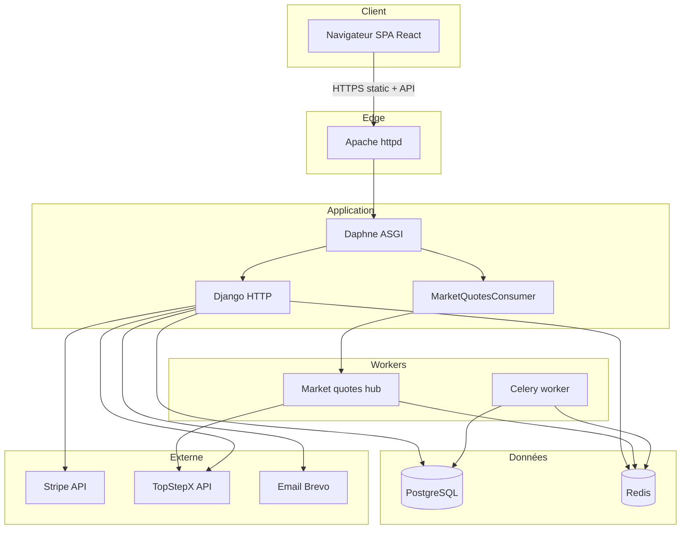

# Vue d'ensemble

## Produit

**K&C Trading Journal** est une application SaaS B2C de journal de trading : saisie et import de trades, tableaux de bord, statistiques avancées, journal quotidien, objectifs, stratégies, replay de session et activité fiscale. Le modèle commercial est freemium avec abonnement Premium via Stripe.

## Stack technique

| Couche | Technologies |
|--------|--------------|
| Frontend | React 19, TypeScript, Create React App, Tailwind CSS, Radix UI, TanStack Query, Chart.js, Recharts, i18next |
| Backend | Django 4.2, Django REST Framework, SimpleJWT, Daphne, Django Channels |
| Données | PostgreSQL (schéma configurable), Redis (cache + broker Celery) |
| Async | Celery (tâches billing), WebSockets (cotations marché) |
| Paiement | Stripe (checkout, portail client, webhooks) |
| Reverse proxy | Apache httpd (production) |
| Process manager | systemd (Daphne, service cotations) |

## Principes d'architecture

1. **Monolithe modulaire** — une instance Django, plusieurs apps métier, frontend SPA compilé servi par Django/Apache.
2. **Isolation par utilisateur** — pas de multi-tenant organisationnel ; chaque ressource est liée à un `User` via clé étrangère.
3. **API-first** — le frontend consomme exclusivement l'API REST (`/api/*`) et les WebSockets (`/ws/*`).
4. **Préférences centralisées** — format date, nombres, langue, fuseau et police via `UserPreferences`, appliqués côté frontend.
5. **Paywall cohérent** — restrictions Premium synchronisées entre frontend (`PREMIUM_LOCKED_PAGES`) et backend (`IsPremiumBundleSubscriberOrAdmin`).

## Diagramme global



## Structure du dépôt

```
trading_journal/
├── backend/                 # Django + DRF
│   ├── trading_journal_api/ # settings, urls, asgi
│   ├── accounts/            # auth, profil, admin
│   ├── trades/              # cœur métier
│   ├── daily_journal/
│   ├── billing/
│   ├── trading_activity/
│   └── integrations/
├── frontend/                # React SPA
│   └── src/
│       ├── pages/
│       ├── components/
│       ├── services/
│       └── i18n/
├── docs/                    # documentation
│   └── architecture/        # ce dossier
├── systemd/                 # unités systemd
├── apache/                  # config Apache exemple
└── deploy_production.sh     # script de déploiement
```

## Points d'entrée

| Entrée | Fichier / URL |
|--------|---------------|
| Configuration Django | `backend/trading_journal_api/settings.py` |
| Routes HTTP | `backend/trading_journal_api/urls.py` |
| ASGI (HTTP + WS) | `backend/trading_journal_api/asgi.py` |
| Application React | `frontend/src/App.tsx` |
| Build frontend prod | `frontend/build/` → servi via `STATICFILES_DIRS` |

## Voir aussi

- [02-backend.md](02-backend.md) — détail des apps Django
- [03-frontend.md](03-frontend.md) — structure React
- [07-infrastructure.md](07-infrastructure.md) — déploiement production
