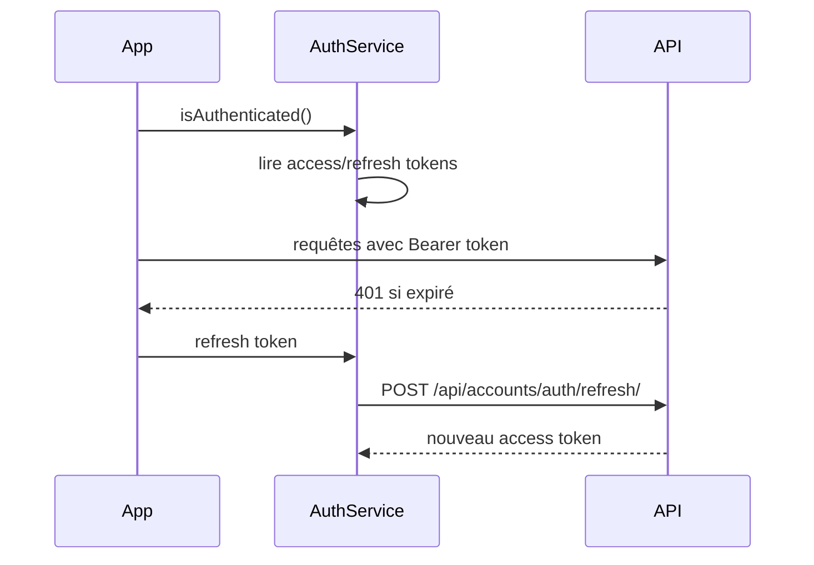

# Frontend React

## Stack

Définie dans `frontend/package.json` :

- **React 19** + **TypeScript 5.7** (Create React App / `react-scripts`)
- **TanStack Query** — cache et requêtes API
- **Axios** — client HTTP (via services)
- **Tailwind CSS** + **Radix UI** + **Lucide** — UI
- **Chart.js** / **Recharts** — graphiques
- **i18next** — internationalisation (9 langues)
- **react-hot-toast** — notifications

Build production : `npm run build` → `frontend/build/`, intégré au `STATICFILES_DIRS` Django.

Option SSR léger : `frontend/scripts/ssr-server.js` (prerender pages marketing).

## Navigation

L'application n'utilise pas React Router pour le cœur métier. La navigation est gérée par un **état local** `currentPage` dans `frontend/src/App.tsx`.

### Pages principales (`frontend/src/pages/`)

| Page | Identifiant `currentPage` | Accès |
|------|---------------------------|-------|
| Accueil marketing | `home` | Public |
| Dashboard | `dashboard` | Gratuit |
| Trades | `trades` | Gratuit |
| Calendrier | `calendar` | Gratuit |
| Journal quotidien | `daily-journal` | Gratuit |
| Transactions | `transactions` | Gratuit |
| Comptes | `accounts` | Gratuit |
| Statistiques | `statistics` | Premium |
| Analytics | `analytics` | Premium |
| Comportement | `behavior` | Premium |
| Objectifs | `goals` | Premium |
| Stratégies | `strategies` | Premium |
| Stratégies de position | `position-strategies` | Premium |
| Activité trading | `trading-activity` | Premium |
| Session replay | `session-replay` | Premium |
| Calculateur | `calculator` | Premium |
| Facturation | `billing` | Authentifié |
| Paramètres | `settings` | Gratuit |
| Admin utilisateurs | `user-management` | Admin |

Constantes de gating : `PREMIUM_LOCKED_PAGES` et `ALWAYS_ACCESSIBLE_PAGES` dans `App.tsx`.

Si `appSettings.premium_restrictions_enabled` est actif et que l'utilisateur n'est pas abonné Premium, redirection vers `SubscriptionRequiredPage`.

## Couche services

`frontend/src/services/` — un service par domaine API :

| Service | Domaine |
|---------|---------|
| `auth.ts` | Login, refresh, logout, tokens |
| `trades.ts` | CRUD trades, filtres |
| `tradingAccounts.ts` | Comptes de trading |
| `dashboard.ts` | Résumés dashboard |
| `billing.ts` | Statut abonnement, checkout |
| `goals.ts` | Objectifs |
| `tradeStrategies.ts` / `positionStrategies.ts` | Stratégies |
| `sessionReplay.ts` | Replay de session |
| `marketQuotes.ts` / `fxRates.ts` | Cotations et FX |
| `integrationsService.ts` | Connexions broker |
| `dailyJournal.ts` | Journal quotidien |
| `tradingActivity.ts` | Activité fiscale |
| `exports.ts` | Export PDF/Excel |
| `calculatorApi.ts` | Calculateur |
| `userService.ts` | Profil, préférences, app settings |

Les services centralisent les appels vers `/api/*` et le format des payloads.

## Contextes et hooks

| Module | Usage |
|--------|-------|
| `contexts/ComplianceRefreshContext` | Rafraîchissement conformité stratégies |
| `contexts/ImageLightboxProvider` | Lightbox images journal / screenshots |
| `hooks/useTheme.ts` | Thème clair/sombre |
| `hooks/usePreferences.ts` | Préférences utilisateur (formatage) |

## Formatage affichage

Règle projet : toute valeur affichée à l'utilisateur respecte les Paramètres.

| Paramètre | Utilitaires |
|-----------|-------------|
| `number_format` | `utils/numberFormat.ts` |
| `date_format`, `timezone` | `utils/dateFormat.ts` |
| `font_family`, `font_size` | appliqués sur `document` / `html` |
| `language` | i18next + locales dans `src/i18n/locales/` |

## Composants

~200 composants dans `frontend/src/components/`, organisés par domaine :

- `analytics/` — corrélations, Monte Carlo, MAE/MFE
- `dashboard/` — KPIs, heatmaps, graphiques
- `layout/` — shell application (sidebar, header)
- `replay/` — session replay
- `SEO/` — Schema.org

## Tests frontend

- Fichiers `*.test.ts` dans `src/` (utils, replay, analytics)
- Commande : `npm test` (Jest via CRA)

## Flux auth côté client

## Voir aussi

- [06-securite-auth.md](06-securite-auth.md) — JWT et paywall
- [05-integrations.md](05-integrations.md) — WebSocket cotations côté client
