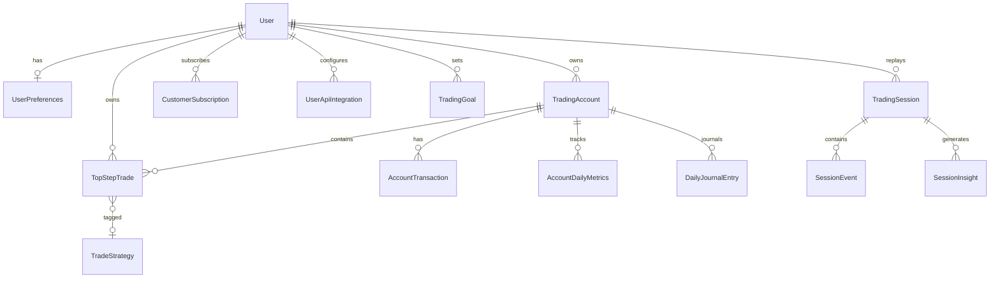

# Modèle de données

PostgreSQL avec schéma configurable (`DB_SCHEMA`, défaut `public`). Toutes les entités métier sont isolées par `user` (ForeignKey vers `accounts.User`).

## Diagramme entités principales

## `accounts`

Fichier : `backend/accounts/models.py`

| Modèle | Description |
|--------|-------------|
| `User` | Utilisateur (`email` comme identifiant, rôles `user` / `admin`) |
| `UserPreferences` | Langue, fuseau, formats date/nombre, police, thème, confidentialité par page |
| `AppSettings` | Singleton applicatif (`premium_restrictions_enabled`, etc.) |
| `LoginHistory` | Historique des connexions |
| `EmailActivationToken` | Tokens d'activation compte |

## `trades`

Fichier : `backend/trades/models.py`

| Modèle | Description |
|--------|-------------|
| `Currency` | Devises de référence |
| `TradingAccount` | Compte de trading (TopStep, IBKR, NinjaTrader, Tradovate, autre) |
| `AccountTransaction` | Dépôts / retraits |
| `AccountDailyMetrics` | Métriques journalières agrégées par compte |
| `TopStepTrade` | Trade normalisé (instrument, P&L, horaires, tags stratégie) |
| `TradeSyncLog` | Journal des synchronisations API |
| `TopStepImportLog` | Journal des imports CSV |
| `TradeStrategy` | Stratégies de trading |
| `PositionStrategy` | Stratégies de position avec screenshots |
| `TradingGoal` | Objectifs (P&L, win rate, etc.) avec alertes |
| `DayStrategyCompliance` | Conformité stratégie par jour |
| `ExportTemplate` | Templates d'export portfolio |
| `TradingSession` | Session de replay |
| `SessionEvent` | Événements timeline replay |
| `SessionInsight` | Insights générés sur une session |
| `SessionJournalDraft` | Brouillon journal lié à une session |

Logique métier associée (hors models) :

- `account_balance.py` — calcul et cache des soldes
- `risk_metrics.py` — profit factor, Sharpe, drawdown, etc.
- `services/behavior_discipline.py` — discipline comportementale
- `replay/` — orchestration replay session

## `daily_journal`

Fichier : `backend/daily_journal/models.py`

| Modèle | Description |
|--------|-------------|
| `DailyJournalEntry` | Texte par jour / compte |
| `DailyJournalImage` | Images attachées à une entrée |

## `trading_activity`

Fichier : `backend/trading_activity/models.py`

| Modèle | Description |
|--------|-------------|
| `TradingActivityExpenseCategory` | Catégories de dépenses |
| `TradingActivityTaxPaymentType` | Types de paiements fiscaux |
| `TradingActivityExpense` | Dépenses professionnelles |
| `TradingActivityCredit` | Crédits / revenus annexes |
| `TradingActivityTaxPayment` | Paiements fiscaux |

## `billing`

Fichier : `backend/billing/models.py`

| Modèle | Description |
|--------|-------------|
| `BillingPlatformSettings` | Singleton (durée essai Stripe) |
| `CustomerSubscription` | Abonnement Stripe par utilisateur |
| `StripeWebhookEvent` | Idempotence des webhooks |

## `integrations`

Fichier : `backend/integrations/models.py`

| Modèle | Description |
|--------|-------------|
| `UserApiIntegration` | Connexion broker par utilisateur (credentials chiffrés, provider slug) |

## Migrations

~169 fichiers de migration Django répartis sur les apps. L'évolution du schéma est continue ; toujours exécuter `migrate` après déploiement.

## Indexation et performance

- Index sur champs fréquemment filtrés (`user`, `status`, dates de trade, `stripe_customer_id`)
- Cache Redis pour soldes compte et cotations marché
- Pagination custom sur les listes de trades (`CustomPageNumberPagination`)

## Voir aussi

- [DATABASE_CONFIG.md](../DATABASE_CONFIG.md) — configuration PostgreSQL
- [02-backend.md](02-backend.md) — endpoints par app
