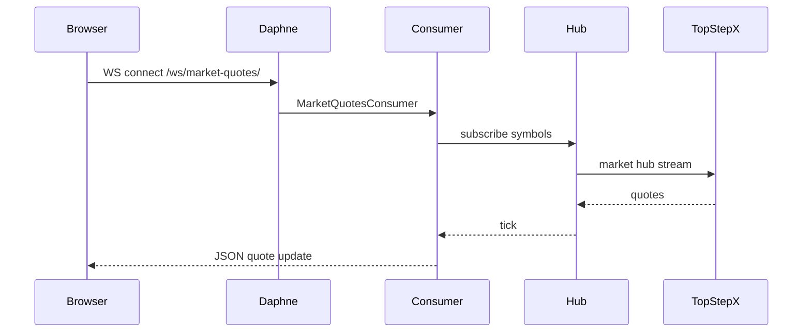

# Intégrations externes

## Architecture providers

Les brokers sont branchés via un **registry** extensible :

```
backend/integrations/providers/
├── base.py          # BaseIntegrationProvider (interface)
├── registry.py      # register_provider / get_provider
└── topstepx.py      # TopStepXProvider (seul provider actif)
```

Enregistrement dans `registry.py` :

```python
_PROVIDERS = {
    TopStepXProvider.slug: TopStepXProvider(),
}
```

Ajouter un provider : implémenter `BaseIntegrationProvider`, appeler `register_provider()`.

## TopStepX

Fichiers clés :

| Fichier | Rôle |
|---------|------|
| `integrations/providers/topstepx.py` | Client API TopStepX |
| `trades/sync/topstepx_sync.py` | Synchronisation des trades |
| `integrations/credentials_crypto.py` | Chiffrement des secrets |

Fonctionnalités :

- Authentification API utilisateur (credentials stockés chiffrés dans `UserApiIntegration`)
- Sync automatique des trades vers `TopStepTrade`
- Récupération des comptes liés
- Barres de prix pour le replay de session
- Connexion au Market Hub (SignalR côté provider)

Types de compte supportés en UI : TopStep, IBKR, NinjaTrader, Tradovate, Autre — seul TopStepX dispose d'une intégration API complète ; les autres passent par import CSV manuel.

## Cotations marché temps réel

### Service backend

`integrations/market_quotes_service.py` + `market_quotes_hub_manager.py`

- Agrège les flux de cotations pour les symboles demandés
- S'appuie sur Redis pour le cache et la coordination
- Service systemd dédié possible : `systemd/trading-journal-market-quotes.service`

### WebSocket

Route : `ws/market-quotes/` (`integrations/routing.py`)

Consumer : `MarketQuotesConsumer` (`integrations/consumers.py`)

Le frontend s'abonne via `frontend/src/services/marketQuotes.ts` pour alimenter le ticker marché (dashboard, replay).



## Taux de change

`integrations/fx_rates_service.py` — taux FX pour conversion multi-devises (comptes, activité trading).

Endpoint REST : `GET /api/trades/fx-rates/`

## Emails

Activation compte et notifications via **Brevo** (variables d'environnement dans `.env.example`).

## Stripe

Voir [STRIPE_SETUP.md](../STRIPE_SETUP.md) et [06-securite-auth.md](06-securite-auth.md).

Événements webhook traités de façon idempotente ; état persisté dans `CustomerSubscription`.

## Jours fériés marché

`pandas-market-calendars` + endpoints :

- `GET /api/trades/market-holidays/`
- `GET /api/trades/market-holidays/today/`

## API utilisateur intégrations

Routes sous `/api/accounts/integrations/` :

- `GET /` — liste des intégrations configurées
- `GET|PUT|DELETE /<provider>/` — détail par provider
- Actions de test/sync selon le provider

## Voir aussi

- [02-backend.md](02-backend.md) — routes API
- [07-infrastructure.md](07-infrastructure.md) — service systemd cotations
