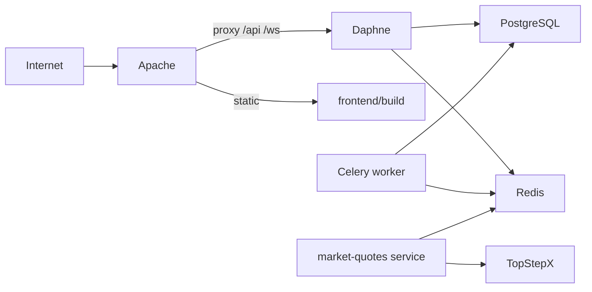

# Infrastructure et déploiement

## Vue production



## Composants

| Composant | Rôle | Fichier / unité |
|-----------|------|-----------------|
| Apache httpd | TLS, reverse proxy, fichiers statiques | `apache/trading-journal.conf` |
| Daphne | Serveur ASGI (HTTP + WebSocket) | `systemd/trading-journal-daphne.service` |
| PostgreSQL | Base de données principale | voir `DATABASE_CONFIG.md` |
| Redis | Cache, broker Celery, hub cotations | variables `REDIS_*` dans `.env` |
| Celery | Tâches async (billing) | worker lancé manuellement ou via systemd |
| Market quotes | Hub cotations (optionnel dédié) | `systemd/trading-journal-market-quotes.service` |

## Script de déploiement

`deploy_production.sh` (~1 100 lignes) — automatise :

- Pull code / checkout tag
- Build frontend (`npm run build`)
- `collectstatic`, migrations
- Redémarrage services systemd
- Vérifications post-déploiement

Configuration exemple : `deploy.config.example`

## Workflow release

Documenté dans `docs/DEPLOYMENT_GITHUB.md` :

1. Développement sur branche `dev`
2. Merge vers `main`
3. Tag SemVer (`vMAJOR.MINOR.PATCH`)
4. Exécution `deploy_production.sh` sur le serveur

## Variables d'environnement critiques

Fichier modèle : `backend/.env.example`

| Variable | Usage |
|----------|-------|
| `DEBUG` | `False` en production |
| `SECRET_KEY` | Clé Django |
| `ALLOWED_HOSTS` | Hôtes autorisés |
| `DB_*` | Connexion PostgreSQL + `DB_SCHEMA` |
| `REDIS_URL` | Cache et Celery |
| `CORS_ALLOWED_ORIGINS` | Origines frontend |
| `STRIPE_*` | Facturation |
| Clés email Brevo | Activation compte |

Frontend production : `frontend/.env.production.example` (`REACT_APP_API_URL`, etc.).

## Logs

- Journal systemd : `journalctl -u trading-journal-daphne`
- Fichiers applicatifs : répertoire de logs défini lors du déploiement (voir plan de déploiement)

## Santé

- `GET /api/health/` — réponse `{"status": "ok"}`, sans données métier, rate-limited
- Utilisé par le footer frontend et la supervision basique

## Sauvegardes

- PostgreSQL : `pg_dump` documenté dans `DEPLOYMENT_PRODUCTION_PLAN.md`
- Endpoint de sauvegarde admin (réservé aux comptes administrateur)

## Développement local

| Service | Commande |
|---------|----------|
| Backend HTTP | `python manage.py runserver` (dev) ou Daphne |
| Frontend | `npm start` (port 3000, proxy vers API) |
| Tests backend | `python manage.py test --keepdb` (venv activé) |

Activer le venv avant toute commande Python :

```bash
cd backend && source venv/bin/activate
```

## Lacunes connues

- Pas de pipeline CI/CD (`.github/workflows` absent)
- Pas de conteneurisation Docker applicative
- Monitoring APM non intégré (logs manuels)
- Celery billing : hook post-webhook minimal

## Voir aussi

- [DEPLOYMENT_PRODUCTION_PLAN.md](../DEPLOYMENT_PRODUCTION_PLAN.md)
- [DEPLOYMENT_DIRECT.md](../DEPLOYMENT_DIRECT.md)
- [01-vue-ensemble.md](01-vue-ensemble.md) — diagramme global
